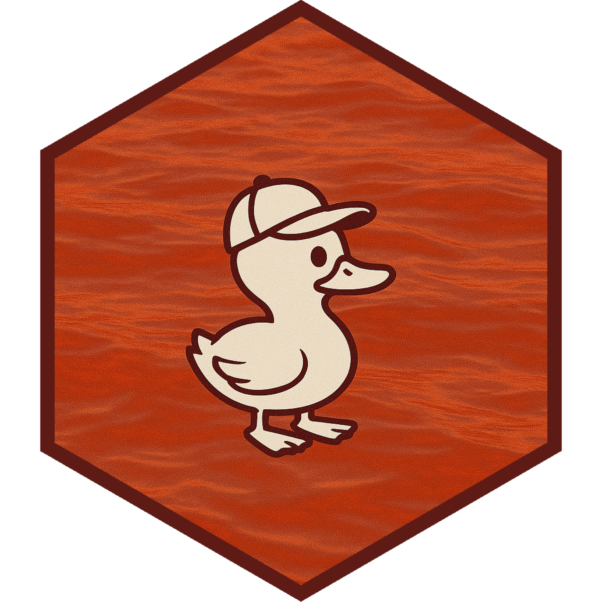

# redquack 

[](https://cran.r-project.org/package=redquack) [](https://github.com/dylanpieper/redquack/actions/workflows/R-CMD-check.yaml)

Transfer [REDCap](https://www.project-redcap.org/) data to a database and use in R without exceeding available memory. Compatible with all databases but specifically optimized for [DuckDB](https://duckdb.org/)—a fast and portable SQL engine with first-class integration in R/Posit products.

## Motivation

R objects live entirely in memory, causing three problems if not using a specialized framework:

1.  You must load full datasets even if you only need a subset
2.  Unused objects still consume memory
3.  Large datasets can easily exceed available memory

redquack's solution to this problem is to:

1.  Request all of the REDCap record IDs to sequence in chunks
2.  Process each chunk of the REDCap data in one R object at a time
3.  Remove each object from memory after it has been transferred to the database

## Features

-   Auto-resume from incomplete transfers
-   Auto-retry for API request failures
-   Auto-convert data types for DuckDB
-   Timestamped operation logs
-   Status messages and progress bar
-   Sound notifications (🔊 🦆)

## Installation

From CRAN:

``` r
# install.packages("pak")
pak::pak("redquack")
```

Development version:

``` r
pak::pak("dylanpieper/redquack")
```

These packages are used in the examples and are not imported by redquack:

``` r
pak::pak(c("dplyr", "duckdb", "keyring"))
```

## Setup API Token

Your REDCap API token allows R to interface with REDCap and should be stored securely. I recommend using the [keyring](https://keyring.r-lib.org) package to store your API token. For example:

``` r
keyring::key_set("redcap_token")
```

## Basic Usage

Data from REDCap is transferred to a database via a [DBI](https://dbi.r-dbi.org) connection in chunks of record IDs:

``` r
library(redquack)

duckdb <- DBI::dbConnect(duckdb::duckdb(), "redcap.duckdb")

result <- redcap_to_db(
  conn = duckdb,
  redcap_uri = "https://redcap.example.org/api/",
  token = keyring::key_get("redcap_token"),
  record_id_name = "record_id",
  chunk_size = 1000  
  # Increase chunk size for memory-efficient systems (faster)
  # Decrease chunk size for memory-constrained systems (slower)
)
```

The function returns a list with class `redcap_transfer_result`:

-   `success`: Logical if the transfer was completed with no failed processing
-   `error_chunks`: Vector of chunk numbers that failed processing
-   `time_s`: Numeric value for total seconds to transfer and optimize data

## Database Structure

The database created by `redcap_to_db()` contains two tables:

1.  `data`: Contains all exported REDCap records with optimized column types

    ``` r
    data <- DBI::dbGetQuery(duckdb, "SELECT * FROM data LIMIT 1000")
    ```

2.  `log`: Contains timestamped logs of the transfer process for troubleshooting

    ``` r
    log <- DBI::dbGetQuery(duckdb, "SELECT * FROM log")
    ```

## Data Types

Data is imported as **VARCHAR/TEXT** for consistent handling across chunks.

For DuckDB, data types are automatically optimized after transfer to improve query performance:

-   **INTEGER**: Columns with only whole numbers
-   **DOUBLE**: Columns with decimal numbers
-   **DATE**: Columns with valid dates
-   **TIMESTAMP**: Columns with valid timestamps
-   **VARCHAR/TEXT**: All other columns remain as strings

In DuckDB, you can query the data to inspect the data types:

``` r
DBI::dbGetQuery(duckdb, "PRAGMA table_info(data)")
```

You can also automatically convert data types in R using [readr](#0):

``` r
readr::type_convert(data)
```

To optimize query performance with other databases, you must alter the data table manually.

### Data Manipulation

Query and collect the data with [dplyr](https://dplyr.tidyverse.org):

``` r
library(dplyr)

demographics <- tbl(duckdb, "data") |>
  filter(is.na(redcap_repeat_instrument)) |>
  select(record_id, age, race, sex, gender) |>
  collect()
```

If you `collect()` your data into memory in the last step, it can make a slow process nearly instantaneous. The following example data is 2,825,092 rows x 397 columns:

``` r
system.time(
  records <- duckdb |>
    tbl("data") |>
    collect() |>
    group_by(redcap_repeat_instrument) |>
    summarize(count = n()) |>
    arrange(desc(count)) 
)
#>   user  system elapsed
#>  5.048   5.006   6.077

system.time(
  records <- duckdb |>
    tbl("data") |>
    group_by(redcap_repeat_instrument) |>
    summarize(count = n()) |>
    arrange(desc(count)) |>
    collect()
)
#>    user  system elapsed
#>   0.040   0.015   0.040
```

You can also write a Parquet file directly from DuckDB and use [arrow](https://arrow.apache.org/docs/r/). A Parquet file will be about 5 times smaller than a DuckDB file:

``` r
DBI::dbExecute(duckdb, "COPY (SELECT * FROM data) TO 'redcap.parquet' (FORMAT PARQUET)")
```

Remember to close the connection when finished:

``` r
DBI::dbDisconnect(duckdb)
```

## Collaboration Opportunities

While this package is only optimized for DuckDB, I invite collaborators to help optimize it for other databases. The pathway I suggest right now is to target your edits in `R/optimize_data_types.R`. Feel free to submit a PR and share any other ideas you may have.

## Other REDCap Interfaces

-   [redcapAPI](https://github.com/vubiostat/redcapAPI) (R package; provides a package comparison table)

-   [PyCap](https://redcap-tools.github.io/PyCap/) (python module)
