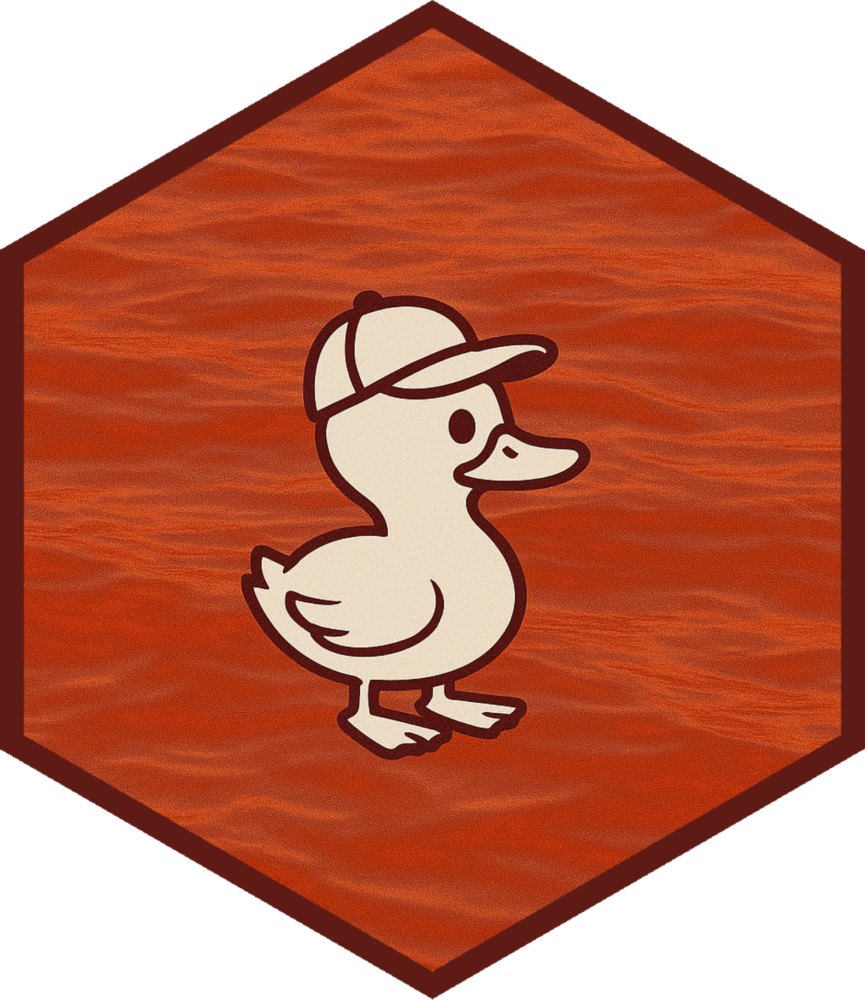

# redquack 

[](https://cran.r-project.org/package=redquack) [](https://github.com/dylanpieper/redquack/actions/workflows/R-CMD-check.yaml)

Transfer [REDCap](https://www.project-redcap.org/) data to a database in chunks and use in R without exceeding available memory. Whether you have a large or small project, enjoy features such as data labeling, converting coded values, and hearing a "quack" sound on success. Compatible with all databases but optimized for [DuckDB](https://duckdb.org/).

## Problem and Solution

Is your project outgrowing your computer? Have you seen this error when using the REDCap API to retrieve data?

**Error: vector memory limit of 16.0 GB reached, see mem.maxVSize()**

What does it mean? Well, R objects a stored in your random access memory (RAM). When your data gets too big, you hit your memory limit. **redquack's solution to this error is to store the data out of memory in a local database for easy retrieval in R.**

The solution:

1.  Request all record IDs in REDCap
2.  Split the record IDs into chunks of 1,000 (default)
3.  Request one chunk of the project data at a time
    a.  Transfer the chunk of data to a database
    b.  Remove the chunk from memory

API requests are handled by [httr2](#0), which persistently retries to ensure your data is transferred successfully.

## Installation

From CRAN:

``` r
# install.packages("pak")
pak::pak("redquack")
```

From GitHub (development version):

``` r
pak::pak("dylanpieper/redquack")
```

These packages are also used in the examples:

``` r
pak::pak(c("keyring", "dplyr"))
```

## Setup API Token

Your API token allows R to interface with your REDCap instance, and it should be stored securely. I recommend using the [keyring](https://keyring.r-lib.org) package to store your API token. For example:

``` r
keyring::key_set("redcap", "test")
```

Use this token to run the examples: 9A81268476645C4E5F03428B8AC3AA7B

## Basic Usage

Data from REDCap is transferred to a database connection in chunks of record IDs:

``` r
library(redquack)
library(dplyr)

conn <- use_duckdb()

result <- redcap_to_db(
  conn,
  url = "https://bbmc.ouhsc.edu/redcap/api/",
  token = keyring::key_get("redcap", "test")
)
```

`redcap_to_db()` returns a list of metadata with class `redcap_transfer_result`:

-   `success`: Logical if the transfer was completed with no failed processing
-   `error_chunks`: Vector of chunk numbers that failed processing
-   `time_s`: Numeric value for total seconds to process all data

## Database Structure

The database created by `redcap_to_db()` contains up to four tables:

1.  `data`: Contains the raw REDCap records

    ``` r
    data <- tbl_redcap(conn) |> collect()
    ```

2.  `metadata`: Contains project metadata for labeling and coded value conversion

    ``` r
    meta <- metadata(conn)
    ```

3.  `redcap_log`: Contains REDCap audit logs from the past week (default)

    ``` r
    redcap_log <- redcap_log(conn)
    ```

4.  `transfer_log`: Contains operation logs of the transfer process

    ``` r
    transfer_log <- transfer_log(conn)
    ```

## Data Types

Data is initially inserted into the database as **VARCHAR/TEXT** for consistent handling across chunks.

For DuckDB, data types are optimized after transfer to improve query performance:

-   **INTEGER**: Columns with only whole numbers
-   **DOUBLE**: Columns with decimal numbers
-   **DATE**: Columns with valid dates
-   **TIMESTAMP**: Columns with valid timestamps
-   **VARCHAR/TEXT**: All other columns remain as strings

You can also query the database to inspect the data types:

``` r
inspect(conn)
```

## Data Manipulation

Retrieve and manipulate your REDCap data with familiar [dplyr](https://dbplyr.tidyverse.org/) verbs and [tbl-like syntax](https://dbplyr.tidyverse.org/reference/tbl.src_dbi.html). The key difference is you reference the database table first using `tbl_redcap()`.

### Basic Retrieval

Retrieve your REDCap data as a single table:

``` r
data <- tbl_redcap(conn) |> 
  collect()
```

### Working with Instruments

Retrieve data organized by REDCap instruments as a list:

``` r
instruments <- tbl_redcap(conn) |>
  collect_list() 
```

Assign instrument data frames to the global environment:

``` r
tbl_redcap(conn) |>
  collect_list() |>
  list_to_env()
```

### Filtering and Selecting Data

Use dplyr verbs to filter and select data before collecting:

``` r
# Filter to specific participants
nutmouse_data <- tbl_redcap(conn) |>
  filter(name_last == "Nutmouse") |>
  collect_labeled_list()

# Select specific columns across all instruments
key_vars <- tbl_redcap(conn) |>
  select(record_id, email, sex, bmi) |>
  collect_list()

# Simple column selection
analysis_data <- tbl_redcap(conn) |>
  select(email, sex) |>
  collect_labeled()
```

### Grouping and Aggregating

Perform complex data manipulation with grouping and filtering:

``` r
# Group by sex and filter to below-average BMI
below_avg_bmi <- tbl_redcap(conn) |>
  select(record_id, sex, bmi) |>
  group_by(sex) |>
  filter(bmi < mean(bmi)) |>
  arrange(bmi) |>
  collect_list()
```

### Working with Labels

Apply column and coded value labels and control value conversion (i.e., choice mappings). `collect_labeled()` and `collect_labeled_list()` give you control over how these labels are applied:

Full labeling and coded value conversion (default):

``` r
data <- tbl_redcap(conn) |> collect_labeled()

data$sex
#> [1] "Female" "Male"   "Male"   "Female" "Male"  
attr(,"label")
#> [1] "Gender"
```

Keep raw coded values:

``` r
data <- tbl_redcap(conn) |> collect_labeled(convert = FALSE)

data$sex
#> <labelled<integer>[5]>: Gender
#> [1] 0 1 1 0 1
#> 
#> Labels:
#>  value  label
#>      0 Female
#>      1   Male
```

Column labels only:

``` r
data <- tbl_redcap(conn) |> collect_labeled(vals = FALSE)

data$sex
#> [1] 0 1 1 0 1
#> attr(,"label")
#> [1] "Gender"
```

Value conversion only:

``` r
data <- tbl_redcap(conn) |> collect_labeled(cols = FALSE)

data$sex  
#> [1] "Female" "Male" "Male" "Female" "Male"

attr(data$sex, "label")
#> NULL
```

### Exporting Data

You can also write a Parquet file directly from DuckDB. A Parquet file will be much smaller than a DuckDB file and easy to share:

``` r
save_parquet(conn, "redcap.parquet")
```

### Cleanup

When you're finished working with your data, clean up your connection:

``` r
close_duckdb(conn)
```

Or, if you do not need to access the data again, remove/delete the file:

``` r
remove_duckdb(conn)
```
